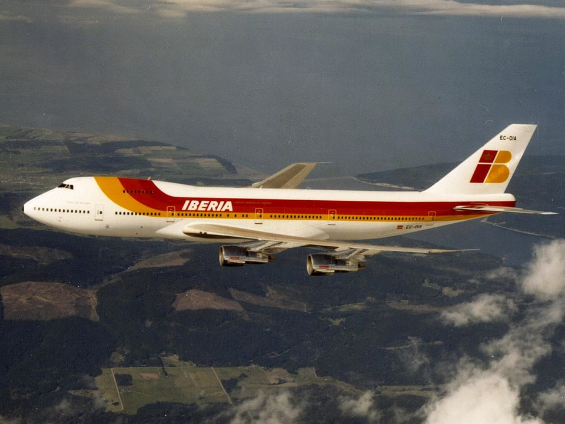

# AAE6202 Homework

| Boeing747 | Simulation |
| --- | --- |
|  |  |


Boeing 747 圆轨迹飞行仿真（LQR 控制 + 4阶 RK 积分）。

## 理论文档
- [Part1：LQR（凸优化背景/二次型）](docs/lqr.md)
- [Part2：RK4（连续动力学离散推进）](docs/rk.md)
- [Part3：Bayes/MAP estimation（卡尔曼滤波）](docs/estimation.md)

## 依赖
- `conda env create -f env.yaml`

## 运行方式
```bash
python3 run.py
```

## 文件说明
- `run.py`：程序主入口，运行仿真并绘图。
- `controller.py`：圆轨迹跟踪控制器（外环引导 + 内环 LQR + 速度保持）。
- `dynamics.py`：波音 747 二维平面动力学模型 + RK4 积分器。
- `estimation.py`：Bayes/MAP 状态估计模块（先验预测 + 测量更新）。
- `visual.py`：飞机点云可视化模块（机身、机翼、尾翼）与动画导出。

## LaTeX 报告
- `latex/_main.tex`：课程报告主文件。
- `latex/Academic.cls`：报告模板类文件。
- `latex/abstract.tex`：摘要内容文件。
- `latex/references.bib`：参考文献数据库。
- `latex/wordcount.py`：LaTeX 正文字数统计脚本。
- `latex/template/`：原始模板备份。
- `latex/output/_main.pdf`：已生成的报告 PDF。
